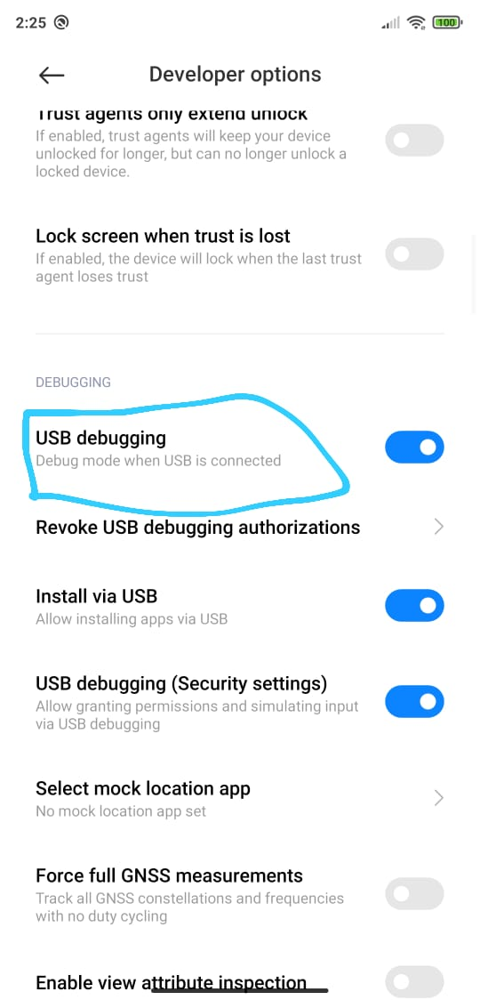

## Instalação e setup do experimento com Android Studio

O documento segue a seguinte

## Download Android studio

Acessar https://developer.android.com/studio e realizar o download para o seu sistema operacional.


## Instalar Tensorflow Examples

Abra o terminal e realize o clone do tensorflow/examples:

`git clone https://github.com/tensorflow/examples.git`

## Abra o projeto pelo Android Studio

Com o Android Studio aberto, selecione a opção "Abrir projeto existente" e navegue até a pasta `object_detection/android`


O Android Studio irá atualizar as dependências do projeto, esse processo pode levar em torno de 5 min dependendo da sua internet.

## Configurar SDK Manager

Acesse o menu de configurações pelo menu `File -> Settings`

Acesse a seção Android SDK, pelo menu `Appearance & Behavior -> System Settings -> Android SDK`

Baixe o SDK respectivo a sua versão atual do Android. Para verificar a sua versão, em seu smartphone navegue em `Settings -> About Phone -> Android Version`


Baixar também o NDK na ver~sao 21.0.6113669 na aba "SDK Tools".

## Atualizar dependências do projeto com Gradle Build

Selecione `File -> Sync Project With Project Files`

## Habilite o modo desenvolvedor no seu Android

No Xiaomi Mi 8, clique diversas vezes na opção "MIUI version" dentro da seção `Settings -> About Phone`

Habilite a opção "USB Debugging" na seção `Settings -> Aditional settings -> Developer Options`



Conecte o cabo USB de seu android ao computador e selecione a opção "File Transfer".

## Copiar modelo treinado para o projeto

Copie o arquivo do seu modelo para a pasta `examples/lite/examples/object_detection/android/app/src/main/assets`. Renomeie o arquivo do modelo para `detect.tflite`

No arquivo `labelmap.txt` remova todas as classes do arquivo e adicione as classes configuradas previamente. Exemplos:

```
baby_groot
```

## Ajustar script de build

No arquivo `download_model.gradle`, abra com o editor de código e comente o arquivo completo, para evitar o download de um modelo externo.

## Configurar para modelo não quantizado

No arquivo `DetectorActivity.java`, trocar o valor da constante `TF_OD_API_IS_QUANTIZED` para `false`

```java
private static final boolean TF_OD_API_IS_QUANTIZED = false;
```


## Execução do projeto

Realize o Build do projeto e aperte o botão "Run".

Quando o aplicativo iniciar, aponte a câmera do seu smartphone para os objetos que você treinou o detector. 
Agora é só comemorar.

